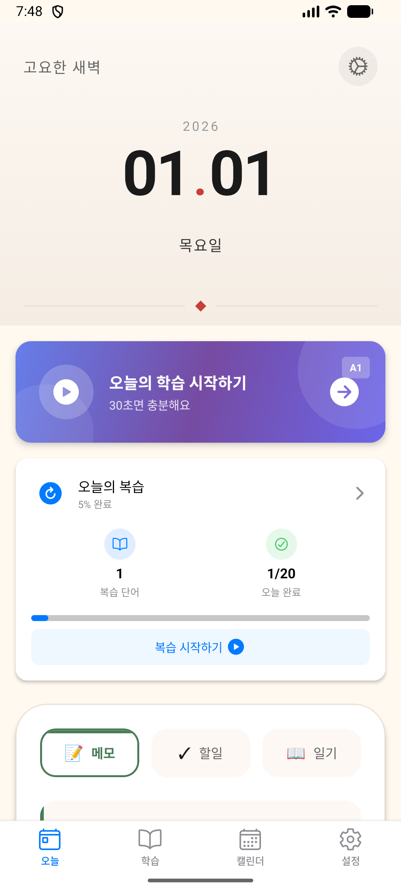
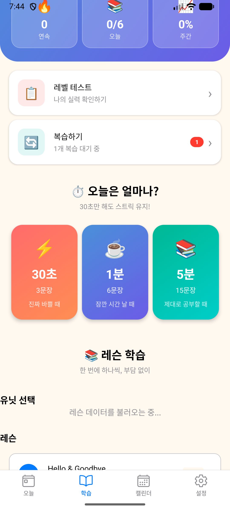
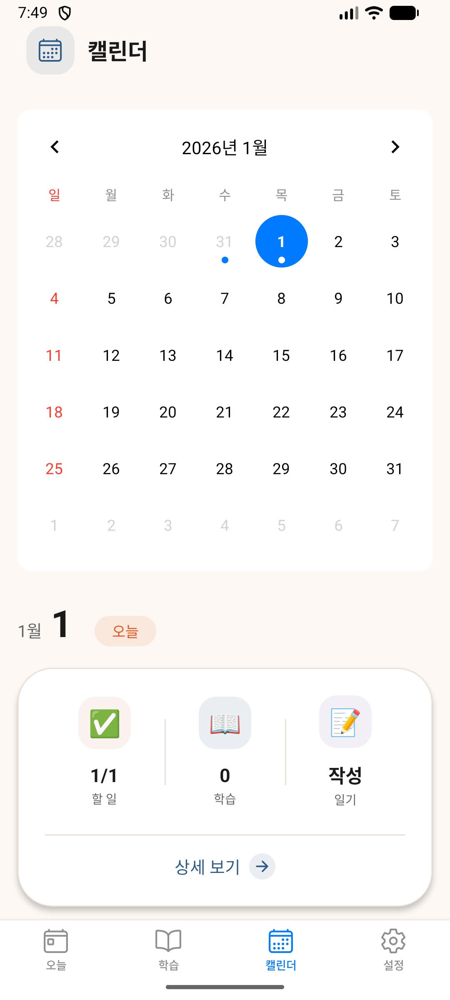
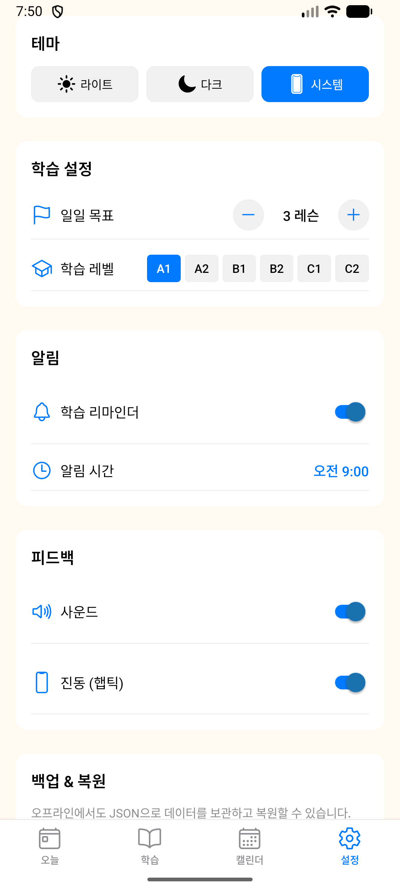
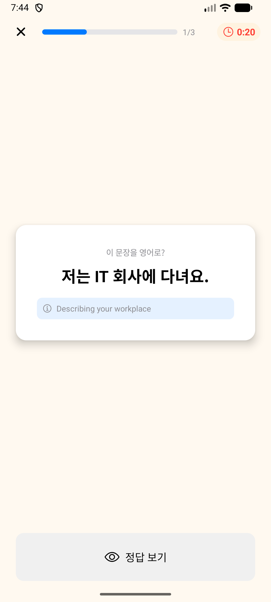

# What To Do? 📝

> **Todo 중심으로 하루를 기록하고, 영어 학습까지 동시에!**

직장인과 학생을 위한 **Day 중심 Todo + 영어 학습 통합 앱**

[](https://www.typescriptlang.org/)
[](https://reactnative.dev/)
[](https://expo.dev/)
[](https://jestjs.io/)

---

## ✨ 핵심 컨셉

**"오늘 내가 뭘 해야 하는지 → 했는지 → 왜 그렇게 느꼈는지를 한 흐름으로 남기는 앱"**

- **Todo가 중심**: 할 일 관리가 핵심
- **Day 단위 관리**: 날짜별로 Todo + Journal + Diary 통합
- **영어 학습 보상**: Todo 완료 → 별 획득 → 학습 활동 잠금 해제
- **완전 오프라인**: 인터넷 연결 없이 모든 기능 사용 가능

---

## 🚀 주요 기능

### 📅 Day 중심 기능 (Phase 1-3 ✅)

- **오늘의 요약 (TodaySummary)**
  - 완료율 프로그레스 바
  - 할 일/학습/기록 통계
  - 자동 생성 인사이트 메시지

- **빠른 메모 (QuickNoteInput)**
  - 한 줄 입력으로 즉시 저장 (200자)
  - Enter 키로 빠른 저장
  - 자동 Journal 통합

- **Day 페이지**
  - Todo 타임라인 (완료/미완료, 시간순)
  - 자동 요약 카드
  - 한 줄 기록 + 빠른 입력 제안

### 📝 Todo 관리

- 생성/수정/삭제/완료
- 우선순위 설정 (긴급, 중요, 보통)
- 마감일 및 시간 설정
- 서브태스크 관리
- 반복 작업 지원

### 📚 영어 학습 (레슨 기반 학습)

- **6개 레벨**: A1 (입문) ~ C2 (최상급) - CEFR 기준
- **구조**: 레벨당 4개 유닛, 유닛당 3개 레슨 (총 12레슨/레벨)
- **6가지 영역**: 어휘, 문법, 듣기, 읽기, 말하기, 쓰기
- **총 288개 활동**: 레슨 기반으로 재구성 (레거시 Week 구조 병행)
- **한국인 특화**: 발음 팁, 흔한 실수, 기억법 포함

### 🔄 간격 반복 학습 (SRS)

- **SM-2 알고리즘** 기반 복습 시스템
- 단어별 난이도 추적
- 최적 복습 타이밍 자동 계산
- 21개 테스트로 검증된 알고리즘

### 💾 백업/복원

- **수동 백업**: 파일로 저장 및 공유
- **자동 백업**: 24시간 간격, 최근 7개 보관
- **안전한 복원**: JSON 검증 후 복원
- 14개 테스트로 안정성 검증

### 🎮 기타 기능

- **온보딩 플로우**: 5개 슬라이드 앱 소개
- **다크모드**: 자동/수동 전환
- **게이미피케이션**: 배지, 스트릭, 별 보상
- **2048 게임**: 휴식 시간 미니게임
- **레벨 테스트**: 적응형 문제로 영어 실력 측정

---

## 📱 스크린샷

| 오늘 탭 | 학습 탭 | 캘린더 탭 | 설정 탭 |
|---------|---------|-----------|---------|
|  |  |  |  |

### 학습 세션
| 문제 풀이 화면 |
|----------------|
|  |

---

## 🛠 기술 스택

### 프레임워크
- **React Native**: 0.74.5
- **Expo**: ~51.0.0
- **Expo Router**: ~3.5.24 (파일 기반 라우팅)

### 언어 & 타입
- **TypeScript**: ~5.9.2 (strict mode)
- 100% 타입 안전성
- 0 컴파일 에러

### 상태 관리
- **Zustand**: ^5.0.9
- 10개 스토어: taskStore, learnStore, srsStore, rewardStore, streakStore, gameStore, userStore, journalStore, diaryStore

### UI/UX
- **React Native Paper**: ^5.14.5
- **Reanimated**: ~3.10.1
- **Gesture Handler**: ~2.16.1
- 다크모드 지원

### 데이터 저장
- **AsyncStorage**: 로컬 영구 저장
- 완전 오프라인 동작
- 자동 백업 시스템

### 테스트
- **Jest**: ^29.2.1
- **ts-jest**: ^29.2.5
- **51개 테스트**: SRS (21), Backup (14), Day utils (16)
- 100% 테스트 통과

### 에러 트래킹
- **Sentry**: ^7.8.0 (선택적 설정)

---

## 🚀 시작하기

### 1️⃣ 저장소 클론

```bash
git clone https://github.com/honghyunwoo/whatTodo.git
cd whatTodo
```

### 2️⃣ 의존성 설치

```bash
npm install
```

### 3️⃣ 개발 서버 시작

```bash
# 기본 실행
npx expo start

# QR 코드 스캔 후 Expo Go 앱에서 테스트
```

### 4️⃣ 플랫폼별 실행

```bash
# Android
npx expo start --android

# iOS (macOS만 가능)
npx expo start --ios

# Web
npx expo start --web
```

### 5️⃣ 테스트 실행

```bash
# 모든 테스트 실행
npm test

# TypeScript 검사
npm run typecheck

# ESLint 검사
npm run lint
```

### 6️⃣ 빌드 (EAS Build)

```bash
# EAS CLI 설치 (최초 1회)
npm install -g eas-cli

# EAS 로그인
eas login

# Android Preview 빌드 (APK)
eas build --profile preview --platform android

# Android Production 빌드 (AAB, Play Store용)
eas build --profile production --platform android

# iOS 빌드 (Apple Developer 계정 필요)
eas build --profile production --platform ios
```

**빌드 프로필** (`eas.json`):
- `development`: 개발용 (시뮬레이터)
- `preview`: 테스트용 (APK 직접 설치)
- `production`: 스토어 배포용 (AAB)

---

## 📂 프로젝트 구조

```
whatTodo/
├── app/                       # 화면 (Expo Router)
│   ├── (tabs)/               # 4탭 네비게이션 ✅
│   │   ├── _layout.tsx       # 탭 레이아웃
│   │   ├── index.tsx         # 오늘 탭 (Day 중심)
│   │   ├── learn.tsx         # 학습 탭
│   │   ├── calendar.tsx      # 캘린더 탭
│   │   └── settings.tsx      # 설정 탭
│   ├── day/                  # Day 관련 (Phase 2 ✅)
│   │   └── [date].tsx        # Day 페이지 (동적 라우팅)
│   ├── diary/                # 다이어리
│   ├── level-test.tsx        # 레벨 테스트
│   └── lesson/               # 레슨 (NEW)
│       └── [id].tsx          # 레슨 상세 페이지
├── components/               # 재사용 컴포넌트
│   ├── home/                 # 홈 화면 (Phase 3 ✅)
│   │   ├── TodaySummary.tsx  # 오늘의 요약 카드
│   │   └── QuickNoteInput.tsx # 빠른 메모 입력
│   ├── day/                  # Day 관련 (Phase 2 ✅)
│   │   ├── DayTimeline.tsx   # Todo 타임라인
│   │   ├── DaySummaryCard.tsx # 자동 요약 카드
│   │   └── DayNoteSection.tsx # 한 줄 기록 입력
│   ├── learn/                # 학습 관련 (70+ 컴포넌트)
│   ├── reward/               # 보상 관련
│   ├── calendar/             # 캘린더
│   ├── dashboard/            # 통계 대시보드
│   └── onboarding/           # 온보딩
├── store/                    # 상태 관리 (Zustand, 10개)
│   ├── taskStore.ts          # Todo 관리
│   ├── journalStore.ts       # 학습 저널
│   ├── diaryStore.ts         # 개인 일기
│   ├── srsStore.ts           # SRS 복습
│   ├── learnStore.ts         # 학습 활동
│   ├── lessonStore.ts        # 레슨 진행 (NEW)
│   ├── testStore.ts          # 레벨 테스트 (NEW)
│   └── ...                   # 기타 스토어
├── utils/                    # 유틸리티 함수
│   ├── day.ts                # Day 통합 함수 (Phase 1 ✅)
│   ├── srs.ts                # SRS 알고리즘 (21 tests)
│   ├── backup.ts             # 백업/복원 (14 tests)
│   ├── statistics.ts         # 통계 계산
│   └── errorHandler.ts       # 에러 처리
├── types/                    # TypeScript 타입
│   ├── day.ts                # Day 관련 타입 (Phase 1 ✅)
│   ├── lesson.ts             # 레슨 타입 (NEW)
│   ├── progress.ts           # 진행률 타입 (NEW)
│   └── test.ts               # 테스트 타입 (NEW)
├── data/                     # 학습 콘텐츠 (JSON)
│   ├── activities/           # 레벨별 활동 (288개)
│   │   ├── a1/ ~ c2/         # 레벨별 (각 48개)
│   └── lessons/              # 레슨 메타데이터 (NEW)
│       └── a1/               # A1 레슨 매핑
├── __tests__/                # 테스트 (51개)
│   └── utils/
│       ├── srs.test.ts       # SRS 테스트 (21)
│       ├── backup.test.ts    # 백업 테스트 (14)
│       └── day.test.ts       # Day 테스트 (16)
├── docs/                     # 문서
│   ├── CURRENT_STATE.md      # 현재 상태 (최신 정보 ✅)
│   └── PRE_LAUNCH_CHECKLIST.md # 상용화 체크리스트 (66.7% 완료)
└── constants/                # 상수 (색상, 크기, 설정)
```

---

## 📊 개발 현황

### ✅ 완료된 Phase

- **Phase 1**: Day 유틸리티 레이어 (types, utils, tests)
- **Phase 2**: Day Page 컴포넌트 (Timeline, Summary, Note)
- **Phase 3**: Home Screen Enhancement (TodaySummary, QuickNote)

### 📈 품질 지표

- **TypeScript**: 0 errors ✅
- **ESLint**: 0 errors, 0 warnings ✅ (2026-01-01 전면 정리)
- **Tests**: 51/51 passing ✅
- **코드 파일**: 650+ .ts/.tsx 파일

### 🚀 상용화 진행률

**66.7%** (50/75 항목 자동 검증 완료)

- ✅ 코드 품질 (5/5) - 100%
- ✅ 보안 (6/6) - 100%
- ✅ 데이터 안정성 (8/9) - 89%
- ⚠️ 사용자 테스트 필요 (25개 항목)

자세한 내용: [PRE_LAUNCH_CHECKLIST.md](docs/PRE_LAUNCH_CHECKLIST.md)

---

## 🧪 테스트

### 테스트 실행

```bash
# 모든 테스트
npm test

# 특정 파일
npm test srs.test.ts

# 커버리지
npm test -- --coverage
```

### 테스트 구성

- **SRS 알고리즘** (21 tests): 간격 반복 학습 로직 검증
- **백업/복원** (14 tests): 데이터 저장/불러오기 안정성
- **Day 유틸리티** (16 tests): 날짜별 데이터 통합 + 엣지 케이스

---

## 📚 학습 콘텐츠

### 레벨 구성

| 레벨 | 설명 | CEFR | 활동 수 |
|------|------|------|---------|
| A1 | 입문 | Beginner | 48 |
| A2 | 초급 | Elementary | 48 |
| B1 | 중급 | Intermediate | 48 |
| B2 | 중상급 | Upper Intermediate | 48 |
| C1 | 고급 | Advanced | 48 |
| C2 | 최상급 | Proficiency | 48 |

**총 288개 활동** = 6레벨 × 8주 × 6영역

### 학습 영역

1. **Vocabulary** (어휘): 단어 학습 + 플래시카드
2. **Grammar** (문법): 문법 설명 + 연습 문제
3. **Listening** (듣기): TTS 음성 + 받아쓰기
4. **Reading** (읽기): 지문 읽기 + 이해 문제
5. **Speaking** (말하기): 발음 연습 (준비 중)
6. **Writing** (쓰기): 작문 연습 (준비 중)

### 한국인 특화 기능

- **발음 팁**: 한국인이 어려워하는 발음 가이드
- **흔한 실수**: 자주 하는 실수 및 교정법
- **기억법**: 단어 암기 팁 및 연상법

---

## 🔒 오프라인 지원

### 완전 오프라인 동작

- ✅ 모든 학습 콘텐츠 로컬 저장 (288개 활동)
- ✅ API 의존성 없음
- ✅ AsyncStorage 기반 데이터 저장
- ✅ TTS: Expo Speech (기기 내장 엔진)
- ✅ 채점: 규칙 기반 로컬 처리

### 백업 시스템

- **수동 백업**: 파일로 저장 → 공유 가능
- **자동 백업**: 24시간 간격, 최근 7개 자동 보관
- **안전한 복원**: JSON 검증 후 데이터 복원

---

## 🎯 핵심 아키텍처

### Day 중심 설계 (Phase 1-3)

```typescript
// Phase 1: Day 데이터 통합
const dayData = getDayData('2025-12-25');
// → { date, todos, diaryEntry, journalEntry, summary }

// Phase 2: Day 페이지 컴포넌트
<DayTimeline todos={dayData.todos} />
<DaySummaryCard summary={dayData.summary} />
<DayNoteSection date={date} existingNote={note} />

// Phase 3: 홈 화면 통합
<TodaySummary />  // 오늘의 요약
<QuickNoteInput /> // 빠른 메모
```

### Store 구조

- **taskStore**: Todo 관리
- **journalStore**: 학습 기록 + 한 줄 메모
- **diaryStore**: 개인 일기 + 감정 기록
- **day.ts utils**: 위 3개 Store 통합 → 날짜별 데이터 제공

---

## 📖 문서

- **[CURRENT_STATE.md](docs/CURRENT_STATE.md)**: 현재 상태 및 최신 작업 내용
- **[PRE_LAUNCH_CHECKLIST.md](docs/PRE_LAUNCH_CHECKLIST.md)**: 상용화 전 체크리스트 (66.7% 완료)
- **[utils/README.md](utils/README.md)**: Day 유틸리티 사용 가이드

---

## 🤝 기여하기

1. Fork this repository
2. Create your feature branch (`git checkout -b feature/amazing-feature`)
3. Commit your changes (`git commit -m 'Add some amazing feature'`)
4. Push to the branch (`git push origin feature/amazing-feature`)
5. Open a Pull Request

### 개발 가이드

```bash
# 브랜치 전략
main                    # 안정 버전
claude/*               # 작업 브랜치

# 코드 품질 체크
npm run typecheck      # TypeScript 검사
npm run lint           # ESLint 검사
npm test               # 테스트 실행
```

---

## 📄 라이선스

MIT License - 자유롭게 사용, 수정, 배포 가능

자세한 내용: [LICENSE](LICENSE)

---

## 👥 만든 사람

- **기획 & 개발**: [@honghyunwoo](https://github.com/honghyunwoo)
- **AI 어시스턴트**: Claude (Anthropic)

---

## 📞 문의 및 버그 제보

- **Issues**: [GitHub Issues](https://github.com/honghyunwoo/whatTodo/issues)
- **Discussions**: [GitHub Discussions](https://github.com/honghyunwoo/whatTodo/discussions)

---

## 🎉 개발 현황

**최신 업데이트**: 2026-01-01

- ✅ Phase 1-3 완료 (Day 중심 전환)
- ✅ 4탭 구조: 오늘|학습|캘린더|설정
- ✅ 레슨 기반 학습 시스템 Step 1-4 완료
- ✅ 51개 테스트 통과 (SRS 21, Backup 14, Day 16)
- ✅ TypeScript 0 errors, ESLint 0 warnings
- ✅ 사용자 테스트 완료 (에뮬레이터)

**다음 단계**: EAS Build → Play Store 배포

---

**⭐️ 이 프로젝트가 도움이 되셨다면 Star를 눌러주세요!**
